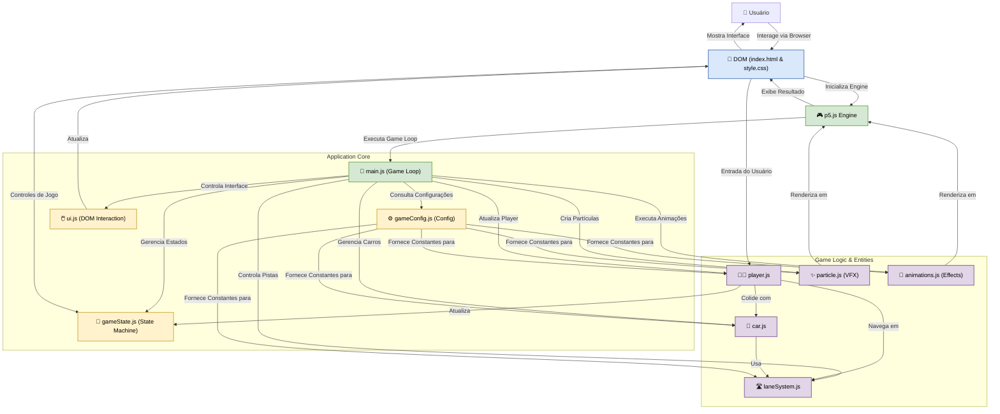

# Cross the Road Journey: Uma Análise Arquitetural de um Jogo de Travessia em p5.js

**Uma jornada de reflexos e estratégia através do caos urbano, renderizada em tempo real com JavaScript e p5.js.**

---

### **Abstract (Resumo Técnico)**

Este repositório documenta o "Cross the Road Journey", um jogo interativo desenvolvido em JavaScript puro com o auxílio da biblioteca p5.js. O projeto reimagina o arquétipo clássico de jogos de travessia (como "Frogger"), abordando o desafio de criar uma experiência de jogo coesa, responsiva e extensível para a plataforma web moderna. A solução proposta implementa uma arquitetura modularizada, onde cada componente do jogo — jogador, veículos, sistema de pistas, estado e interface — é encapsulado em seu próprio módulo JavaScript. A metodologia central baseia-se em um loop de jogo gerenciado pelo p5.js, uma máquina de estados finitos para controlar os fluxos de interação (menu, jogo, game over), e um sistema de dificuldade dinâmica que escala com o progresso do jogador, aumentando a complexidade e o re-engajamento. O resultado é um jogo funcional e polido, com suporte a múltiplos dispositivos (desktop e mobile) e uma base de código organizada que serve como um artefato de estudo para o desenvolvimento de jogos web. A principal contribuição do projeto reside na demonstração de uma arquitetura de software limpa e desacoplada para jogos 2D em JavaScript, mesmo sem o uso de frameworks complexos, destacando padrões de design para gerenciamento de estado, renderização híbrida (Canvas e DOM) e escalabilidade de gameplay.

### **Badges Abrangentes**


### **Sumário (Table of Contents)**

1.  [Introdução e Motivação](#introdução-e-motivação)
2.  [🔗 Demonstração Online](#-demonstração-online)
3.  [Arquitetura do Sistema](#arquitetura-do-sistema)
4.  [Decisões de Design Chave](#decisões-de-design-chave)
5.  [✨ Funcionalidades Detalhadas](#-funcionalidades-detalhadas-com-casos-de-uso)
6.  [🛠️ Tech Stack Detalhado](#️-tech-stack-detalhado)
7.  [📂 Estrutura Detalhada do Código-Fonte](#-estrutura-detalhada-do-código-fonte)
8.  [📋 Pré-requisitos Avançados](#-pré-requisitos-avançados)
9.  [🚀 Guia de Instalação e Configuração Avançada](#-guia-de-instalação-e-configuração-avançada)
10. [⚙️ Uso Avançado e Exemplos](#️-uso-avançado-e-exemplos)
11. [🧪 Estratégia de Testes e Qualidade de Código](#-estratégia-de-testes-e-qualidade-de-código)
12. [🚢 Deployment Detalhado e Escalabilidade](#-deployment-detalhado-e-escalabilidade)
13. [🤝 Contribuição (Nível Avançado)](#-contribuição-nível-avançado)
14. [📜 Licença e Aspectos Legais](#-licença-e-aspectos-legais)
15. [👥 Equipe Principal e Colaboradores Chave](#-equipe-principal-e-colaboradores-chave)
16. [🗺️ Roadmap Detalhado e Visão de Longo Prazo](#️-roadmap-detalhado-e-visão-de-longo-prazo)
17. [❓ FAQ (Perguntas Frequentes)](#-faq-perguntas-frequentes)
18. [📞 Contato e Suporte](#-contato-e-suporte)

### **Introdução e Motivação**

A criação de jogos para a web apresenta um conjunto único de desafios, que vão desde o gerenciamento de performance de renderização em tempo real até a garantia de uma experiência de usuário consistente em uma vasta gama de dispositivos. Este projeto nasceu da motivação de explorar esses desafios, utilizando JavaScript como a linguagem principal e a biblioteca `p5.js` como o motor gráfico. O objetivo não era apenas recriar um conceito de jogo conhecido, mas sim usá-lo como um veículo para aprofundar o conhecimento em princípios fundamentais de desenvolvimento de software, como modularização, gerenciamento de estado e design responsivo.

Soluções existentes para jogos web frequentemente recorrem a motores de jogo pesados ou frameworks complexos. A proposta de valor deste projeto é demonstrar que é possível construir uma experiência de jogo rica e completa com uma stack minimalista, focando na clareza do código e na aplicação de padrões de design sólidos. O projeto se diferencia ao implementar funcionalidades avançadas sobre uma base simples, como um sistema de níveis que altera dinamicamente a configuração do jogo (adicionando novas pistas e aumentando a velocidade dos carros), animações de feedback visual (como a tela de "Level Up" e efeitos de partículas), e um sistema de controle duplo (teclado e toque) que se adapta ao dispositivo do usuário. A motivação central é, portanto, pedagógica e técnica: criar um artefato que seja ao mesmo tempo divertido de jogar e valioso como um caso de estudo para desenvolvedores interessados em `creative coding` e arquitetura de aplicações interativas.

### **🔗 Demonstração Online**

Uma versão funcional e interativa do projeto está hospedada e pode ser acessada publicamente. Interaja com a aplicação para observar a dinâmica do jogo, a responsividade da interface e as funcionalidades em ação.

**[🚀 Acesse a Demonstração Ao Vivo Aqui](https://java-script-xi.vercel.app)**

### **Arquitetura do Sistema**

A arquitetura do "Cross the Road Journey" foi projetada com foco na separação de responsabilidades (Separation of Concerns), resultando em um sistema modular e de fácil manutenção. Embora não utilize um sistema de módulos formal (como ES Modules ou CommonJS), a separação é alcançada logicamente através de múltiplos arquivos `.js`, cada um encapsulando uma faceta do jogo.

O diagrama abaixo ilustra os principais componentes arquiteturais e suas interações:



**Descrição dos Componentes:**

*   **Browser Environment (Ambiente do Navegador):**
    *   **p5.js Engine:** O coração do sistema. Gerencia o ciclo de vida do canvas (`setup`, `draw`), o loop de renderização, e abstrai as interações de baixo nível com a API de Canvas do HTML5 e eventos de entrada.
    *   **DOM (index.html & style.css):** Define a estrutura da página e a interface do usuário (UI) estática, como placares e botões. A estilização é responsiva, adaptando-se a diferentes tamanhos de tela.

*   **Application Core (Núcleo da Aplicação):**
    *   **`main.js` (Orquestrador do Jogo):** Ponto de entrada principal da lógica do jogo. Inicializa todos os objetos, gerencia o loop de jogo principal (`draw`), verifica colisões e orquestra as atualizações de todos os outros módulos a cada frame.
    *   **`gameState.js` (Máquina de Estados):** Define e gerencia o estado atual do jogo (ex: `MENU`, `PLAYING`). Essa separação permite que a lógica de renderização e atualização se comporte de maneira diferente dependendo do que está acontecendo no jogo.
    *   **`gameConfig.js` (Configuração Estática):** Centraliza constantes e parâmetros de configuração do jogo (como dimensões do canvas e dificuldade inicial), permitindo ajustes fáceis sem alterar a lógica principal.
    *   **`ui.js` (Controlador da UI):** Módulo responsável por mediar a comunicação entre a lógica do jogo e os elementos do DOM, como atualizar o placar de pontos ou exibir telas de overlay.

*   **Game Logic & Entities (Lógica e Entidades do Jogo):**
    *   **`player.js`, `car.js`, `particle.js`:** Representam as entidades dinâmicas do jogo. Cada arquivo define o comportamento, os dados e a lógica de renderização de sua respectiva entidade.
    *   **`laneSystem.js`:** Um módulo crucial que abstrai a lógica das pistas de tráfego. Ele calcula a posição das pistas e, mais importante, implementa a lógica de escalabilidade da dificuldade, determinando quantas pistas estão ativas com base no nível do jogador.
    *   **`animations.js`:** Encapsula lógicas de animações complexas, como o efeito de "Level Up", mantendo o `main.js` mais limpo.

### **Decisões de Design Chave**

1.  **Uso da Biblioteca p5.js:** A escolha do `p5.js` foi estratégica para acelerar o desenvolvimento. Ele oferece uma API de alto nível para desenho e interatividade, eliminando a necessidade de gerenciar o contexto do canvas manualmente e simplificando a captura de eventos de teclado e mouse. Isso permitiu focar mais na lógica do jogo e menos na complexidade da API do navegador.

2.  **Arquitetura Modular via Globais:** Para manter a simplicidade e evitar a necessidade de um `module bundler` (como Webpack ou Rollup), o projeto adota uma abordagem de modularização onde os módulos expõem suas funcionalidades anexando-as ao objeto global `window`. Embora eficaz para projetos de pequena e média escala, essa abordagem apresenta o trade-off de poluir o namespace global e pode levar a conflitos em aplicações maiores.

3.  **Máquina de Estados Explícita (`gameState`):** Em vez de usar múltiplas variáveis booleanas para controlar o fluxo do jogo (`isPaused`, `isGameOver`), foi implementada uma máquina de estados simples. Isso torna o código mais robusto e legível, pois o comportamento do jogo em qualquer momento é determinado por um único e claro estado (`MENU`, `PLAYING`, etc.).

4.  **Sistema de Dificuldade Dinâmica (`laneSystem`):** Uma decisão fundamental para aumentar a longevidade e o desafio do jogo. A dificuldade não é estática; ela escala com o desempenho do jogador (nível). O `laneSystem.js` centraliza essa lógica, tornando o jogo progressivamente mais difícil de uma maneira controlada e previsível, adicionando novas pistas e permitindo carros mais rápidos.

5.  **Interface Híbrida (Canvas + DOM):** A arquitetura combina o melhor de dois mundos. O `canvas` do p5.js é usado para a renderização do mundo do jogo (jogador, carros, pistas), que exige atualizações a cada frame. Elementos de UI mais estáticos, como placares, botões e overlays, são implementados como elementos HTML/CSS padrão. Essa abordagem é performática (evita redesenhar texto e botões no canvas constantemente) e aproveita o poder do CSS para estilização e responsividade.

### **✨ Funcionalidades Detalhadas (com Casos de Uso)**

*   **Controle Responsivo do Jogador:**
    *   **Descrição:** O jogador pode ser controlado tanto por teclado (Setas Direcionais e WASD) em dispositivos desktop quanto por botões de toque na tela em dispositivos móveis.
    *   **Caso de Uso:** Um usuário acessa o jogo em seu smartphone. A interface detecta o ambiente de toque e exibe os controles na tela, permitindo uma jogabilidade completa. Outro usuário, em um laptop, utiliza as teclas WASD para uma navegação precisa e rápida.

*   **Sistema de Níveis e Dificuldade Progressiva:**
    *   **Descrição:** O jogo começa com um número limitado de pistas. A cada 50 pontos, o jogador avança de nível. O avanço de nível desbloqueia novas pistas de tráfego, aumenta a velocidade geral dos carros e introduz veículos especiais mais rápidos, aumentando o desafio.
    *   **Caso de Uso:** Um jogador, ao atingir o nível 4, observa que uma nova pista de tráfego foi adicionada na parte superior da estrada, e os carros existentes agora se movem visivelmente mais rápido, exigindo maior atenção e reflexos.

*   **Animações e Feedback Visual:**
    *   **Descrição:** O jogo fornece feedback visual rico para ações importantes. Uma animação de "Level Up" em tela cheia celebra o progresso do jogador. Efeitos de partículas são gerados quando o jogador atravessa com sucesso ou colide com um carro. O jogador pisca durante um curto período de invulnerabilidade após reaparecer.
    *   **Caso de Uso:** Ao ser atingido por um carro, o jogador explode em partículas vermelhas. Ao reaparecer, seu personagem pisca por alguns segundos, indicando visualmente ao jogador que ele não pode ser atingido novamente de imediato.

*   **Placar e Persistência de Recorde:**
    *   **Descrição:** A interface exibe a pontuação atual, o nível e o recorde máximo (High Score). O recorde é salvo localmente no navegador do usuário usando `localStorage`, persistindo entre as sessões de jogo.
    *   **Caso de Uso:** Um jogador fecha o navegador após atingir 350 pontos. Ao reabrir o jogo no dia seguinte, o "Recorde" na UI ainda exibe "350", motivando-o a superar sua própria marca.

*   **Design Totalmente Responsivo:**
    *   **Descrição:** A interface e a área de jogo se adaptam a qualquer tamanho de tela, de monitores widescreen a telas de smartphones na vertical. O CSS utiliza media queries e unidades flexíveis, e o JavaScript recalcula as dimensões do canvas dinamicamente.
    *   **Caso de Uso:** O jogador começa a jogar em seu monitor 4K. Ele então redimensiona a janela do navegador, e todos os elementos do jogo e da UI se reajustam perfeitamente para caber no novo espaço, sem quebras de layout ou perda de funcionalidade.

### **🛠️ Tech Stack Detalhado**

| Categoria | Tecnologia | Versão Específica | Propósito no Projeto | Justificativa da Escolha |
| :--- | :--- | :--- | :--- | :--- |
| **Linguagem Principal** | JavaScript | ES6+ | Implementação de toda a lógica de cliente, interatividade e manipulação do jogo. | Linguagem universal da web, permitindo execução nativa em todos os navegadores sem transpilação ou dependências complexas. |
| **Motor Gráfico/Interativo** | [p5.js](https://p5js.org/) | 1.5.0 | Renderização no canvas, gerenciamento do loop de jogo (`setup`/`draw`), e abstração de eventos de entrada (teclado/mouse). | API amigável e de alto nível para `creative coding`, ideal para prototipagem rápida e desenvolvimento de projetos visuais sem a verbosidade da API Canvas nativa. |
| **Áudio** | p5.sound.js | 1.5.0 | Carregamento e controle de efeitos sonoros e música de fundo (funcionalidade de mudo). | Extensão oficial do p5.js que se integra perfeitamente ao ecossistema, simplificando a manipulação de áudio na web. |
| **Estrutura de Página** | HTML5 | - | Definição da estrutura semântica da aplicação, incluindo o container do canvas e os elementos da UI. | Padrão atual para desenvolvimento web, oferecendo semântica rica e compatibilidade. |
| **Estilização** | CSS3 | - | Estilização visual, layout responsivo (Flexbox), animações e design da UI sobreposta ao jogo. | Poderosas capacidades de estilização e layout responsivo (Media Queries), essenciais para a experiência multi-dispositivo. |
| **Deployment** | [Vercel](https://vercel.com/) | - | Hospedagem e distribuição da aplicação web estática, com integração contínua a partir do GitHub. | Plataforma otimizada para projetos frontend, oferecendo deploy gratuito, rápido e automatizado, com CDN global e HTTPS por padrão. |

### **📂 Estrutura Detalhada do Código-Fonte**

A organização do projeto reflete a arquitetura modular, com uma clara separação entre a estrutura (HTML), a apresentação (CSS) e o comportamento (JavaScript).

```
cross-the-road-journey-main/
├── css/
│   └── style.css         # Folha de estilos principal, com regras para UI, responsividade e layout.
├── js/
│   ├── main.js           # Orquestrador central: inicializa o jogo e gerencia o loop principal (draw).
│   ├── player.js         # Define a classe 'Player', sua lógica de movimento, colisão e renderização.
│   ├── car.js            # Define a classe 'Car', seu movimento, tipos e renderização.
│   ├── ui.js             # Controla a interação com os elementos do DOM (placar, overlays).
│   ├── gameState.js      # Gerencia o estado global do jogo (menu, jogando, etc.).
│   ├── gameConfig.js     # Armazena configurações e constantes globais do jogo.
│   ├── laneSystem.js     # Lógica para cálculo de pistas e escalabilidade de dificuldade.
│   ├── particle.js       # Classe para os efeitos de partículas (explosões, pontos).
│   └── animations.js     # Lógica para animações especiais, como a de "Level Up".
├── index.html            # Ponto de entrada da aplicação, carrega todos os scripts e estilos.
└── README.md             # Este arquivo de documentação.
```

### **📋 Pré-requisitos Avançados**

Para executar o projeto, os únicos pré-requisitos são:

*   Um **navegador web moderno** com suporte a HTML5, CSS3 e JavaScript (ES6). (Ex: Google Chrome, Mozilla Firefox, Microsoft Edge, Safari).
*   Para desenvolvimento local, é altamente recomendado o uso de um **servidor web local** para servir os arquivos. Isso evita potenciais problemas de segurança (CORS) que os navegadores impõem ao carregar arquivos diretamente do sistema de arquivos (`file:///...`).

### **🚀 Guia de Instalação e Configuração Avançada**

Siga os passos abaixo para configurar um ambiente de desenvolvimento local.

1.  **Clonar o Repositório:**
    Abra um terminal e clone o repositório do GitHub para a sua máquina local.

    ```bash
    git clone https://github.com/ESousa97/cross-the-road-journey.git
    ```

2.  **Navegar para o Diretório do Projeto:**

    ```bash
    cd cross-the-road-journey
    ```

3.  **Executar com um Servidor Local:**
    A maneira mais simples de iniciar um servidor local é usando uma extensão do seu editor de código ou uma ferramenta de linha de comando.

    *   **Opção A: Usando a extensão "Live Server" no Visual Studio Code:**
        1.  Instale a extensão [Live Server](https://marketplace.visualstudio.com/items?itemName=ritwickdey.LiveServer) no VS Code.
        2.  Abra o diretório do projeto no VS Code.
        3.  Clique com o botão direito no arquivo `index.html` e selecione "Open with Live Server".
        4.  Seu navegador padrão abrirá automaticamente com o jogo em execução.

    *   **Opção B: Usando Python (se instalado):**
        No terminal, dentro do diretório do projeto, execute um dos seguintes comandos:

        ```bash
        # Para Python 3
        python -m http.server

        # Para Python 2
        python -m SimpleHTTPServer
        ```
        Abra seu navegador e acesse `http://localhost:8000`.

    *   **Opção C: Usando Node.js (se instalado):**
        Instale um servidor globalmente (apenas uma vez):
        ```bash
        npm install -g http-server
        ```
        Depois, no diretório do projeto, execute:
        ```bash
        http-server
        ```
        Abra seu navegador e acesse o endereço fornecido (geralmente `http://localhost:8080`).

### **⚙️ Uso Avançado e Exemplos**

Para desenvolvedores que desejam experimentar e modificar o comportamento do jogo, os seguintes arquivos são pontos de partida interessantes:

*   **Ajustar a Dificuldade:** Abra `js/gameConfig.js`. Você pode alterar os valores dentro do objeto `difficulty` para modificar o quão rápido o jogo se torna mais difícil.
    ```javascript
    // js/gameConfig.js
    window.gameConfig = {
        // ...
        difficulty: {
            initial: 1,       // Nível inicial
            increment: 2,     // Aumenta a velocidade dos carros neste fator
            maxLevel: 50      // Nível máximo
        }
    };
    ```

*   **Modificar o Comportamento das Pistas:** Em `js/laneSystem.js`, você pode alterar o número total de pistas (`laneCount`) ou a fórmula que determina a chance de um carro rápido aparecer (`getFastLaneChance`).

*   **Alterar a Física do Jogador:** Em `js/player.js`, modifique a variável `this.speed` para tornar o jogador mais rápido ou mais lento.

### **🧪 Estratégia de Testes e Qualidade de Código**

Neste estágio do projeto, não há uma suíte de testes automatizados (unitários, integração ou E2E) implementada. A verificação da qualidade e a detecção de regressões foram realizadas através de testes manuais e exploratórios em diferentes navegadores (Chrome, Firefox) e dispositivos (desktop, mobile simulado via DevTools).

A qualidade do código é mantida através da estrutura modular e da adesão a convenções de nomenclatura claras, facilitando a legibilidade e a manutenção. Futuras melhorias poderiam incluir a introdução de um framework de testes como o [Jest](https://jestjs.io/) para testes unitários da lógica de jogo (ex: colisões, pontuação) e ferramentas de linting como o [ESLint](https://eslint.org/) para garantir a consistência do estilo de código.

### **🚢 Deployment Detalhado e Escalabilidade**

O projeto está implantado na **Vercel**, uma plataforma de nuvem especializada em aplicações frontend e sites estáticos.

*   **Processo de Deploy:** A Vercel está conectada diretamente ao repositório no GitHub. Cada `push` para a branch `main` aciona um novo build e deploy automaticamente. Esse processo de Integração e Entrega Contínua (CI/CD) garante que a versão online esteja sempre sincronizada com o código mais recente.

*   **Infraestrutura:** A Vercel distribui os ativos do projeto (HTML, CSS, JS) através de uma Rede de Distribuição de Conteúdo (CDN) global. Isso garante tempos de carregamento rápidos para usuários em qualquer parte do mundo.

*   **Escalabilidade:** Como uma aplicação puramente client-side, a escalabilidade é inerentemente alta. Toda a lógica é executada no navegador do usuário, e a Vercel lida com a entrega escalável dos arquivos estáticos. Não há um backend de servidor que precise ser escalado, o que torna a arquitetura extremamente robusta e de baixo custo para um grande número de usuários simultâneos.

### **🤝 Contribuição (Nível Avançado)**

Contribuições para melhorar o "Cross the Road Journey" são muito bem-vindas! Se você tem ideias para novas funcionalidades, melhorias de código ou correções de bugs, siga este guia para colaborar.

1.  **Fork e Clone:**
    *   Faça um **Fork** deste repositório para a sua própria conta do GitHub.
    *   Clone o seu fork para a sua máquina local: `git clone https://github.com/SEU_USUARIO/cross-the-road-journey.git`.

2.  **Branching Model:**
    *   Crie uma nova branch para a sua feature ou correção: `git checkout -b feature/nome-da-feature` ou `git checkout -b fix/descricao-do-bug`.

3.  **Desenvolvimento:**
    *   Implemente suas alterações, mantendo o estilo e a arquitetura do código existente.
    *   Adicione comentários claros para novas lógicas complexas.

4.  **Convenções de Commit:**
    *   Escreva mensagens de commit claras e descritivas. O uso do padrão [Conventional Commits](https://www.conventionalcommits.org/) é encorajado (ex: `feat: adiciona power-up de invencibilidade`).

5.  **Pull Request (PR):**
    *   Faça o `push` da sua branch para o seu fork no GitHub: `git push origin feature/nome-da-feature`.
    *   Abra um **Pull Request** do seu fork para a branch `main` do repositório original.
    *   Na descrição do PR, explique detalhadamente as alterações que você fez e por quê.

*   **Reportar Bugs e Sugerir Features:** Utilize a seção [**Issues**](https://github.com/ESousa97/cross-the-road-journey/issues) do repositório para relatar problemas ou propor novas ideias.

### **📜 Licença e Aspectos Legais**

Atualmente, o projeto não possui um arquivo de licença explícito. Isso significa que, por padrão, os direitos autorais são retidos pelo autor. Para reutilizar, modificar ou distribuir este código, é recomendado entrar em contato com o autor ou abrir uma issue para solicitar o esclarecimento da licença. A adição de uma licença de código aberto (como MIT ou Apache 2.0) é uma melhoria futura planejada.

### **👥 Equipe Principal e Colaboradores Chave**

Este projeto foi concebido e desenvolvido por:

*   **Enoque Sousa**
    *   **GitHub:** [@ESousa97](https://github.com/ESousa97)
    *   **LinkedIn:** [Enoque Sousa](https://www.linkedin.com/in/enoque-sousa-bb89aa168/)

### **🗺️ Roadmap Detalhado e Visão de Longo Prazo**

O projeto atual serve como uma base sólida. A visão de longo prazo é expandi-lo para uma experiência de jogo ainda mais rica e tecnicamente robusta.

*   **Curto Prazo (Próximas Versões):**
    *   [ ] Adicionar mais efeitos sonoros para interações (movimento, botões).
    *   [ ] Implementar um sistema de pausa funcional.
    *   [ ] Adicionar uma licença de código aberto (ex: MIT).

*   **Médio Prazo:**
    *   [ ] Introduzir novos tipos de veículos com comportamentos diferentes (ex: caminhões lentos, motos rápidas).
    *   [ ] Criar "power-ups" coletáveis na pista (ex: invencibilidade temporária, slow-motion).
    *   [ ] Refatorar o código para usar ES Modules, eliminando a dependência do escopo global e melhorando a manutenibilidade.

*   **Longo Prazo (Visão):**
    *   [ ] Desenvolver diferentes temas de níveis (ex: atravessar um rio com troncos, uma fase espacial com asteroides).
    *   [ ] Integrar um leaderboard online usando um serviço de backend simples (ex: Firebase).
    *   [ ] Escrever uma suíte de testes unitários para a lógica de jogo principal.

### **❓ FAQ (Perguntas Frequentes)**

*   **P: O jogo não carrega ou aparece uma tela em branco. O que fazer?**
    *   **R:** Isso geralmente acontece ao abrir o `index.html` diretamente do sistema de arquivos. Por razões de segurança, os navegadores restringem isso. Por favor, siga as instruções na seção [Guia de Instalação](#-guia-de-instalação-e-configuração-avançada) para executar o jogo a partir de um servidor local.

*   **P: Como o recorde (High Score) é salvo?**
    *   **R:** O jogo utiliza a API `localStorage` do seu navegador. Isso significa que o recorde é salvo localmente no seu dispositivo e persistirá mesmo que você feche e reabra o navegador. Ele não é compartilhado entre diferentes navegadores ou dispositivos.

*   **P: Posso jogar no meu celular?**
    *   **R:** Sim! O jogo foi projetado para ser totalmente responsivo e inclui controles de toque na tela que aparecem automaticamente em dispositivos móveis.

### **📞 Contato e Suporte**

Para relatar bugs, fazer perguntas técnicas, sugerir novas funcionalidades ou discutir o projeto, o canal preferencial e oficial é a seção de **Issues** do repositório no GitHub.

➡️ [**Abrir uma Issue**](https://github.com/ESousa97/cross-the-road-journey/issues)