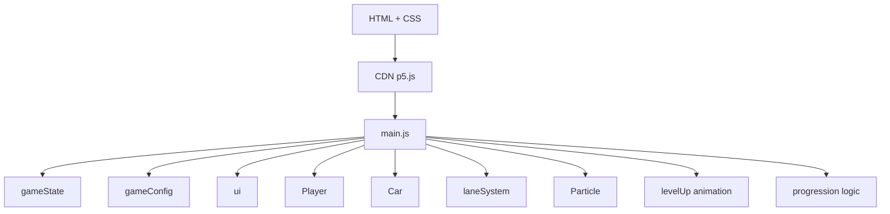

---
<div align="center">

# 🚦 Cross the Road Journey

> Jogo web inspirado em Frogger, reescrito com arquitetura modular, Vite, lint/test automatizados e UX responsiva.

[](https://github.com/ESousa97/cross-the-road-journey/actions/workflows/ci.yml)
[](https://www.codefactor.io/repository/github/esousa97/cross-the-road-journey/overview/main)
[](LICENSE)
[](#stack)
[](#status)

</div>

## Visao geral
O objetivo e atravessar faixas de trafego sem colisao, com dificuldade crescente e controles para desktop/mobile. O projeto serve como referencia de jogo 2D em JavaScript com p5.js, organizado para contribuiçao publica, com testes, lint, CI e documentaçao completa.

## Problema e motivacao
- Modernizar um jogo classico para web responsiva.
- Demonstrar arquitetura limpa para jogos em JavaScript sem engines pesadas.
- Facilitar contribuicoes open source com automaçao (lint/test/build) e governanca pronta.

## Funcionalidades
- Controles: teclado (setas/WASD) e botoes touch.
- Progressao dinamica: novas faixas e carros mais rapidos a cada limiar de pontos.
- Persistencia local: recorde salvo em `localStorage`.
- Efeitos visuais: particulas, animacao de level up e indicadores de spawn.
- Responsividade: UI adaptada para telas pequenas e safe-area em mobile.
- Tooling: Vite, ESLint, Stylelint, Prettier, Vitest, Husky.

## Stack e requisitos
- Runtime: Node.js 18+ (dev) e navegador moderno (execucao).
- Ferramentas: Vite, p5.js (CDN), ESLint, Stylelint, Prettier, Vitest.
- Sistema: Windows/macOS/Linux.

## Instalacao
```bash
git clone https://github.com/ESousa97/cross-the-road-journey.git
cd cross-the-road-journey
npm install
```

## Uso (dev e prod)
- Desenvolvimento: `npm run dev` e acesse o host indicado (padrao http://localhost:4173).
- Build estatico: `npm run build` gera `dist/` pronto para deploy (GitHub Pages, Vercel, etc.).
- Preview do build: `npm run preview`.
- Jogo online: abra `dist/index.html` apos o build ou sirva o repositorio com Vite.

### Controles in-game
- Desktop: setas ou WASD; ESPACO pausa.
- Mobile: botoes touch aparecem automaticamente.

## Configuracao rapida
- Dificuldade e limites: `src/config/gameConfig.js`.
- Progresso/score: `src/core/progression.js`.
- Faixas e distribuicao: `src/systems/laneSystem.js`.
- UI e overlays: `src/ui/ui.js`.
- Animacoes: `src/animations/levelUp.js`.

## Arquitetura
```
src/
  config/          constantes de jogo
  state/           estado e persistencia
  core/            logica pura (progressao, testes)
  entities/        Player, Car, Particle
  systems/         faixas e trafego
  animations/      animacao de level up
  ui/              HUD/overlays
  main.js          loop p5, orquestracao
```

Diagrama (alto nivel):


## Scripts
- `npm run dev` — servidor de desenvolvimento.
- `npm run build` — build de producao.
- `npm run preview` — preview do build.
- `npm run lint` — ESLint + Stylelint.
- `npm run format` — Prettier em todos os arquivos.
- `npm run test` / `npm run test:watch` — suite Vitest.
- `npm run check` — lint + test.

## Roadmap curto
- [ ] SFX e trilha com mute granular.
- [ ] Tabelas de ranking online.
- [ ] Temas de cores opcionais (modo claro/escuro).
- [ ] Novos obstaculos e power-ups.

## Contribuicao
Leia [CONTRIBUTING.md](CONTRIBUTING.md) para padroes de branch, commits (Conventional Commits), abertura de issues/PRs e comando de qualidade local. Codigo de conduta em [CODE_OF_CONDUCT.md](CODE_OF_CONDUCT.md).

## Licenca
MIT — veja [LICENSE](LICENSE). Para contribuições, concorde com o Code of Conduct e siga as politicas de segurança (vide [SECURITY.md](SECURITY.md)).

## Status
Maintained. CI executa lint/test/build em cada PR. Dependabot habilitado para manter toolchain atualizada.

## Suporte
Abra uma issue ou envie um PR. Para vulnerabilidades, siga [SECURITY.md](SECURITY.md).

