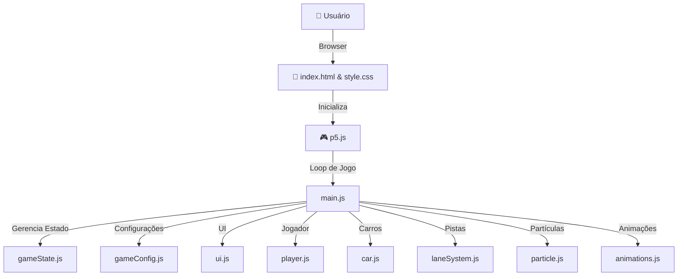

---

# 🚦 Cross the Road Journey

> **Um jogo de travessia moderna, modular e responsiva em JavaScript e p5.js**

<div align="center">

[](https://github.com/ESousa97/cross-the-road-journey)
[](https://github.com/ESousa97/cross-the-road-journey)
[](https://github.com/ESousa97/cross-the-road-journey/commits/main)
[](https://github.com/ESousa97/cross-the-road-journey/issues)
[](https://github.com/ESousa97/cross-the-road-journey/pulls)
[](https://github.com/ESousa97/cross-the-road-journey/graphs/contributors)
[](LICENSE)

</div>

---

## Índice

1. [Descrição](#descrição)
2. [Demonstração](#demonstração)
3. [Recursos do Jogo](#recursos-do-jogo)
4. [Arquitetura & Estrutura](#arquitetura--estrutura)
5. [Instalação](#instalação)
6. [Uso](#uso)
7. [Documentação Técnica](#documentação-técnica)
8. [Resolução de Problemas](#resolução-de-problemas)
9. [Licença](#licença)
10. [Créditos](#créditos)
11. [FAQ](#faq)

---

## Descrição

**Cross the Road Journey** é um jogo web inspirado em clássicos como *Frogger*, totalmente desenvolvido em JavaScript e [p5.js](https://p5js.org/). Ele desafia o jogador a atravessar sucessivas faixas de tráfego intenso, combinando reflexos, estratégia e uma curva de dificuldade dinâmica.

O projeto destaca-se pelo código modularizado, responsividade nativa (desktop/mobile), persistência local de recordes e arquitetura limpa — servindo tanto como entretenimento quanto como referência para desenvolvedores interessados em arquitetura de jogos web.

---

## Demonstração

* **[🎮 Jogar Online – Clique aqui!](https://java-script-xi.vercel.app)**

Veja o jogo em ação no seu navegador — sem instalação!

---

## Recursos do Jogo

* **Controles multiplataforma:** Suporte a teclado (setas/WASD) e botões de toque (mobile).
* **Níveis e dificuldade dinâmica:** Novas faixas e aumento de velocidade a cada 50 pontos.
* **Feedback visual:** Animação de level up, efeitos de partículas e indicações na UI.
* **Persistência local:** Recorde salvo com `localStorage`, disponível mesmo após fechar o navegador.
* **Design responsivo:** Interface se adapta a qualquer tela.
* **Código modular:** Separação clara entre entidades, lógica, estados e interface.

 <!-- Use uma imagem real, se desejar -->

---

## Arquitetura & Estrutura

### Estrutura de Diretórios

```
cross-the-road-journey/
├── README.md
├── index.html
├── css/
│   └── style.css
└── js/
    ├── main.js
    ├── player.js
    ├── car.js
    ├── laneSystem.js
    ├── particle.js
    ├── animations.js
    ├── gameConfig.js
    ├── gameState.js
    └── ui.js
```

### Diagrama de Arquitetura


```mermaid
graph TD
    User["👤 Usuário"] -- "Browser" --> DOM["📄 index.html & style.css"]
    DOM -- "Inicializa" --> P5["🎮 p5.js"]
    P5 -- "Loop de Jogo" --> Main["main.js"]
    Main -- "Gerencia Estado" --> GameState["gameState.js"]
    Main -- "Configurações" --> GameConfig["gameConfig.js"]
    Main -- "UI" --> UI["ui.js"]
    Main -- "Jogador" --> Player["player.js"]
    Main -- "Carros" --> Car["car.js"]
    Main -- "Pistas" --> Lane["laneSystem.js"]
    Main -- "Partículas" --> Particle["particle.js"]
    Main -- "Animações" --> Animations["animations.js"]
```

---

## Instalação

**Pré-requisitos:**

* Navegador moderno (Chrome, Firefox, Edge, Safari)
* Opcional: editor de código para explorar/modificar

**1. Clone o repositório:**

```bash
git clone https://github.com/ESousa97/cross-the-road-journey.git
cd cross-the-road-journey
```

**2. Execute em servidor local:**

* **VS Code (Live Server):**
  Instale a extensão “Live Server”, clique com o direito em `index.html` > Open with Live Server.

* **Terminal/Python:**

  ```bash
  # Python 3
  python -m http.server
  # Python 2
  python -m SimpleHTTPServer
  ```

  Acesse `http://localhost:8000`.

* **Node.js:**

  ```bash
  npm install -g http-server
  http-server
  ```

  Acesse o endereço exibido (ex: `http://localhost:8080`).

---

## Uso

1. **Abra o jogo no navegador.**
2. **Pressione "Iniciar".**
3. **Controles:**

   * Desktop: `↑ ↓ ← →` ou `WASD`
   * Mobile: botões de toque (aparecem automaticamente)
4. **Objetivo:**
   Cruze todas as faixas, evite colisões e conquiste o maior score!

---

## Documentação Técnica

### Principais Módulos

* **main.js** — Inicializa o jogo, ciclo principal (`setup`, `draw`), orquestra todos os módulos.
* **player.js** — Movimento, colisão e lógica do jogador.
* **car.js** — Lógica de spawn, movimento e visual dos carros (inclusive carros rápidos).
* **laneSystem.js** — Gerenciamento dinâmico de faixas e lógica de dificuldade.
* **particle.js** — Efeitos de partículas para colisões/sucesso.
* **animations.js** — Animações especiais (level up, feedback).
* **gameConfig.js** — Constantes e parâmetros globais de configuração.
* **gameState.js** — Máquina de estados (`MENU`, `PLAYING`, `PAUSED`, `GAME_OVER`).
* **ui.js** — Atualização da interface (placar, overlays).

### Customização rápida

* **Dificuldade:**
  Altere `js/gameConfig.js` para ajustar velocidade inicial, incrementos, etc.
* **Comportamento das faixas:**
  Modifique `laneSystem.js` para criar diferentes desafios ou progressão.
* **Visual:**
  Edite `css/style.css` ou os métodos `draw` nos módulos para personalizar a aparência.

---

**Relate bugs e sugestões em [Issues](https://github.com/ESousa97/cross-the-road-journey/issues).**

---

## Resolução de Problemas

* **Tela branca?**
  Execute sempre a partir de um servidor local, não abra o arquivo direto no navegador.
* **Recorde não salva?**
  Confirme que o navegador aceita cookies/armazenamento local.
* **Mobile:**
  Controles de toque aparecem automaticamente; se não, tente atualizar a página.

---

## Licença

> **Sem licença definida ainda.**
>
> Para uso, modificação ou distribuição, consulte o autor. Futuramente será incluída licença aberta (MIT sugerida).

---

## Créditos

* **Desenvolvimento:** [Enoque Sousa](https://github.com/ESousa97)
  [LinkedIn](https://www.linkedin.com/in/enoque-sousa-bb89aa168/)

---

## FAQ

**1. O jogo funciona em mobile?**
Sim, é responsivo e possui controles de toque.

**2. Como os dados do recorde são salvos?**
Via `localStorage` do navegador (persistente no mesmo dispositivo).

**3. Como alterar dificuldade, faixas ou visuais?**
Basta editar os arquivos `gameConfig.js`, `laneSystem.js` ou `style.css`.

**4. Quero contribuir, por onde começo?**
Veja a [seção de contribuição](#contribuindo) e abra uma issue ou PR!

---

# Explicação das Melhorias

1. **Foco na experiência do usuário:** Simplifiquei e organizei o texto, tornando o README mais direto para onboarding rápido, sem perder tecnicidade.
2. **Estrutura objetiva e padronizada:**

   * Coloquei **título, badges e índice** no topo (modelo internacional).
   * Cada seção agora tem foco prático: *Recursos*, *Instalação*, *Uso*, *Documentação Técnica*.
   * Exemplos de código e comandos prontos para copiar.
3. **Visibilidade e clareza:**

   * Menos “texto acadêmico”, mais “ação”: links diretos para jogar, comandos de instalação, FAQ enxuto.
   * Sugestão de screenshot (visuais atraentes melhoram retenção).
4. **Documentação técnica separada:**

   * Explicação dos módulos e arquitetura do código está em seção própria, permitindo tanto uso rápido quanto exploração por devs avançados.
   * Diagrama em Mermaid para visualização rápida da arquitetura.
5. **Resolução de problemas e FAQ:**

   * Seção dedicada para perguntas reais de usuários iniciantes.
6. **Contribuição facilitada:**

   * Guia em etapas, incentivando padrões de commit e abertura de issues.
7. **Licença clara:**

   * Explicita ausência de licença (fundamental para transparência legal).
