---
# 🚦 Cross the Road Journey

> **Um jogo de travessia moderna, modular e responsiva em JavaScript e p5.js**

<div align="center">

[](https://github.com/ESousa97/cross-the-road-journey)
[](https://github.com/ESousa97/cross-the-road-journey)
[](https://github.com/ESousa97/cross-the-road-journey/commits/main)
[](https://github.com/ESousa97/cross-the-road-journey/graphs/contributors)

</div>

---

<div align="center">
⚡ Visão Rápida

| **🔗 Online**       | [Acesse aqui na Vercel 🚀](https://java-script-xi.vercel.app)                                      |
| ------------------- | --------------------------------------------------------------------------------------------------------- |
| **👤 Autor**        | José Enoque Costa de Sousa                                                                                |
| **📍 Localização**  | São Bernardo do Campo, SP - Brasil                                              |
| **🌐 Contatos**     | [LinkedIn](https://www.linkedin.com/in/enoque-sousa-bb89aa168/) • [GitHub](https://github.com/SousaDev97) |
</div>

---

## Índice

1. [Descrição](#descrição)
2. [Demonstração](#demonstração)
3. [Recursos do Jogo](#recursos-do-jogo)
4. [Arquitetura & Estrutura](#arquitetura--estrutura)
5. [Instalação](#instalação)
6. [Uso](#uso)
7. [Documentação Técnica](#documentação-técnica)
8. [Resolução de Problemas](#resolução-de-problemas)
9. [Licença](#licença)
10. [Créditos](#créditos)
11. [FAQ](#❓-faq)

---

## Descrição

**Cross the Road Journey** é um jogo web inspirado em clássicos como *Frogger*, totalmente desenvolvido em JavaScript e [p5.js](https://p5js.org/). O desafio: atravessar sucessivas faixas de tráfego intenso, combinando reflexos, estratégia e uma curva de dificuldade dinâmica.

O projeto destaca-se pelo código modular, responsividade (desktop/mobile), persistência local de recordes e arquitetura limpa — servindo tanto como entretenimento quanto como referência para desenvolvedores interessados em arquitetura de jogos web.

---

## Demonstração

* **[🎮 Jogar Online – Clique aqui!](https://java-script-xi.vercel.app)**
* Veja o jogo em ação no seu navegador — sem instalação!

---

## Recursos do Jogo

- **Controles multiplataforma:** Suporte a teclado (setas/WASD) e botões de toque (mobile)
- **Níveis e dificuldade dinâmica:** Novas faixas e aumento de velocidade a cada 50 pontos
- **Feedback visual:** Animação de level up, efeitos de partículas e UI adaptativa
- **Persistência local:** Recorde salvo com `localStorage`, disponível mesmo após fechar o navegador
- **Design responsivo:** Interface se adapta a qualquer tela
- **Código modular:** Separação clara entre entidades, lógica, estados e interface

---

## Arquitetura & Estrutura

### Estrutura de Diretórios

```bash
cross-the-road-journey/
├── README.md
├── LICENSE
├── index.html
├── css/
│   └── style.css
├── js/
│   ├── main.js
│   ├── player.js
│   ├── car.js
│   ├── laneSystem.js
│   ├── particle.js
│   ├── animations.js
│   ├── gameConfig.js
│   ├── gameState.js
│   └── ui.js
├── video/
│   └── cross-the-road-journey.gif
````

### Diagrama de Arquitetura

```mermaid
graph TD
    User["👤 Usuário"] -- "Browser" --> DOM["📄 index.html & style.css"]
    DOM -- "Inicializa" --> P5["🎮 p5.js"]
    P5 -- "Loop de Jogo" --> Main["main.js"]
    Main -- "Gerencia Estado" --> GameState["gameState.js"]
    Main -- "Configurações" --> GameConfig["gameConfig.js"]
    Main -- "UI" --> UI["ui.js"]
    Main -- "Jogador" --> Player["player.js"]
    Main -- "Carros" --> Car["car.js"]
    Main -- "Pistas" --> Lane["laneSystem.js"]
    Main -- "Partículas" --> Particle["particle.js"]
    Main -- "Animações" --> Animations["animations.js"]
```



---

## Instalação

**Pré-requisitos:**

* Navegador moderno (Chrome, Firefox, Edge, Safari)
* Opcional: editor de código para explorar/modificar

**1. Clone o repositório:**

```bash
git clone https://github.com/ESousa97/cross-the-road-journey.git
cd cross-the-road-journey
```

**2. Execute em servidor local:**

* **VS Code (Live Server):**
  Instale a extensão “Live Server”, clique com o direito em `index.html` > Open with Live Server.

* **Terminal/Python:**

  ```bash
  # Python 3
  python -m http.server
  # Python 2
  python -m SimpleHTTPServer
  ```

  Acesse `http://localhost:8000`.

* **Node.js:**

  ```bash
  npm install -g http-server
  http-server
  ```

  Acesse o endereço exibido (ex: `http://localhost:8080`).

---

## Uso

1. **Abra o jogo no navegador**
2. **Pressione "Iniciar"**
3. **Controles:**

   * Desktop: `↑ ↓ ← →` ou `WASD`
   * Mobile: botões de toque (aparecem automaticamente)
4. **Objetivo:**
   Cruze todas as faixas, evite colisões e conquiste o maior score!

---

## Documentação Técnica

### Principais Módulos

* **main.js** — Inicializa o jogo, ciclo principal (`setup`, `draw`), orquestra todos os módulos
* **player.js** — Movimento, colisão e lógica do jogador
* **car.js** — Lógica de spawn, movimento e visual dos carros (inclusive carros rápidos)
* **laneSystem.js** — Gerenciamento dinâmico de faixas e lógica de dificuldade
* **particle.js** — Efeitos de partículas para colisões/sucesso
* **animations.js** — Animações especiais (level up, feedback)
* **gameConfig.js** — Constantes e parâmetros globais de configuração
* **gameState.js** — Máquina de estados (`MENU`, `PLAYING`, `PAUSED`, `GAME_OVER`)
* **ui.js** — Atualização da interface (placar, overlays)

### Customização rápida

* **Dificuldade:**
  Altere `js/gameConfig.js` para ajustar velocidade inicial, incrementos, etc.
* **Comportamento das faixas:**
  Modifique `laneSystem.js` para criar diferentes desafios ou progressão.
* **Visual:**
  Edite `css/style.css` ou os métodos `draw` nos módulos para personalizar a aparência.

---

**Relate bugs e sugestões em [Issues](https://github.com/ESousa97/cross-the-road-journey/issues).**

---

## Resolução de Problemas

* **Tela branca?**
  Execute sempre a partir de um servidor local, não abra o arquivo direto no navegador.
* **Recorde não salva?**
  Confirme que o navegador aceita cookies/armazenamento local.
* **Mobile:**
  Controles de toque aparecem automaticamente; se não, tente atualizar a página.

---

## 📜 Licença

Este projeto está licenciado sob a [Licença MIT](./LICENSE) — uso livre para fins pessoais, acadêmicos e comerciais.
Sinta-se à vontade para modificar, estudar e compartilhar!

> **Atribuição:** Mantenha os créditos ao autor original em forks e derivados.

---

## Créditos

* **Desenvolvimento:** [José Enoque Costa de Sousa](https://github.com/ESousa97)
  [LinkedIn](https://www.linkedin.com/in/enoque-sousa-bb89aa168/)

---

## ❓ FAQ

**1. O jogo funciona em dispositivos móveis?**

> Sim! O Cross the Road Journey foi desenvolvido com design responsivo e possui controles de toque automáticos em telas menores.

**2. Preciso instalar algo para jogar?**

> Não, basta acessar o link online no navegador. Só para desenvolver/modificar você precisa clonar o repositório e rodar localmente.

**3. Como meu recorde é salvo?**

> O recorde fica gravado localmente no navegador via `localStorage`, ou seja, permanece salvo mesmo fechando o site (mas não transfere entre dispositivos).

**4. Dá para modificar as regras, visual ou dificuldade?**

> Sim! O código é modular. É só editar os arquivos em `/js` (ex: `gameConfig.js` para dificuldade, `laneSystem.js` para as pistas, `style.css` para o visual).

**5. Posso usar partes do código no meu próprio projeto?**

> Pode usar como inspiração, mas recomendo adaptar e personalizar — e mantenha o crédito ao autor original.

**6. Quais tecnologias eu preciso saber para contribuir?**

> HTML5, CSS3 e JavaScript puro (com p5.js). Se você domina esses fundamentos, pode contribuir fácil!

**7. O projeto aceita contribuições externas?**

> Sim! Sugestões, PRs e feedbacks são bem-vindos. Basta abrir uma issue ou PR pelo GitHub.

**8. Está aberto para colaborações, freelas ou parcerias?**

> Sempre! Me chama pelo LinkedIn ou e-mail para conversarmos sobre parcerias, features ou outros games.

---

<div align="center">

Feito com dedicação por <strong>José Enoque Costa de Sousa</strong> 💻

</div>

> ✨ **Criado em:** 23 de abr. de 2023 às 21:44

---
